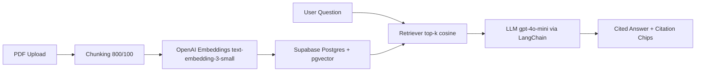

# ClinicDocs AI

ClinicDocs AI is a production-oriented RAG chatbot for medical clinic staff to search internal SOP PDFs with grounded answers and page-level citations.

Metric placeholder: **40% reduction in SOP lookup time**

## Demo

Add a 30-second demo GIF at `docs/demo.gif` and embed it:

```md

```

## Architecture



## Tech Stack

- Backend: Python 3.12, FastAPI, LangChain, OpenAI, slowapi, structlog
- Database: Postgres + pgvector (Supabase in production)
- Frontend: React + Vite + Tailwind CSS + shadcn/ui-style components
- Auth: Supabase Auth (email/password)
- Deployment target:
  - Backend: Render free tier
  - Frontend: Cloudflare Pages
  - Database: Supabase free tier

## Features

- PDF upload endpoint with native text detection and OCR fallback via Tesseract
- Recursive chunking (`chunk_size=800`, `overlap=100`)
- Vector storage in `documents` with `vector(1536)` embeddings
- Streaming chat endpoint (SSE) with citation list (`file`, `page`, `snippet`)
- Clickable citation chips in chat UI
- Admin tools: full re-index and latest 50 query logs with latency
- Rate limiting: `10 req/min` per IP
- Structured JSON logs using structlog
- Retrieval evaluation script: hit_rate@5 against 20 ground-truth QA pairs
- HIPAA banner in UI:
  - `For staff reference only — do not input patient PHI`

## Quickstart

```bash
git clone <your-repo-url>
cd clinicdocs-ai
cp .env.example .env
docker compose up --build
```

App URLs:

- Frontend: `http://localhost:5173`
- Backend docs: `http://localhost:8000/docs`

## Environment Variables

Root `.env`:

```env
OPENAI_API_KEY=
SUPABASE_URL=
SUPABASE_ANON_KEY=
SUPABASE_SERVICE_KEY=
DATABASE_URL=postgresql+psycopg://postgres:postgres@db:5432/clinicdocs
ENVIRONMENT=development
VITE_API_BASE_URL=http://localhost:8000
```

Use the Supabase anon/publishable key for `SUPABASE_ANON_KEY` so Auth can validate
browser user sessions. Keep `SUPABASE_SERVICE_KEY` for server-side database reads,
writes, and RPC calls only.

## Database Migration

SQL migration is at:

- `backend/migrations/001_init.sql`

It enables pgvector, creates `documents` and `query_logs`, and adds an IVFFlat cosine index.

## Evaluation

Run retrieval benchmark:

```bash
docker compose exec backend python tests/eval/evaluate_retrieval.py
```

The script logs:

- `total`
- `hits`
- `hit_rate_at_5`

## Deploy Notes

1. Supabase:
   - Create a project, run `backend/migrations/001_init.sql`.
2. Render:
   - Deploy `backend/` Docker service and set env vars.
3. Cloudflare Pages:
   - Build command: `npm run build`
   - Build output: `dist`
   - Set `VITE_API_BASE_URL` to your Render API URL.

## Cloudflare Backend Option

An alternate Cloudflare Workers backend lives in `backend-cloudflare/`. It keeps the
same frontend-facing endpoints, uses Cloudflare Workers AI instead of OpenAI, and
requires the Supabase migration in `backend-cloudflare/migrations/`.

Run the Cloudflare backend locally with the frontend:

```bash
docker compose -f docker-compose.cloudflare.yml up --build
```

This serves the Worker backend at `http://localhost:8787` and the frontend at
`http://localhost:5173` with `VITE_API_BASE_URL=http://localhost:8787`.
